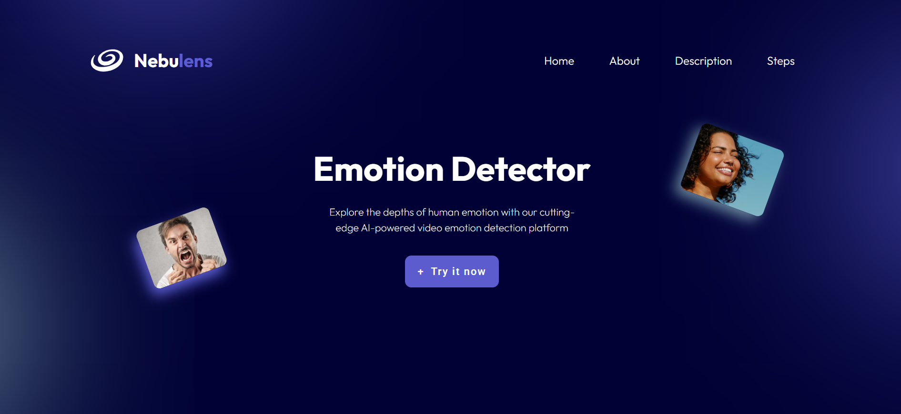
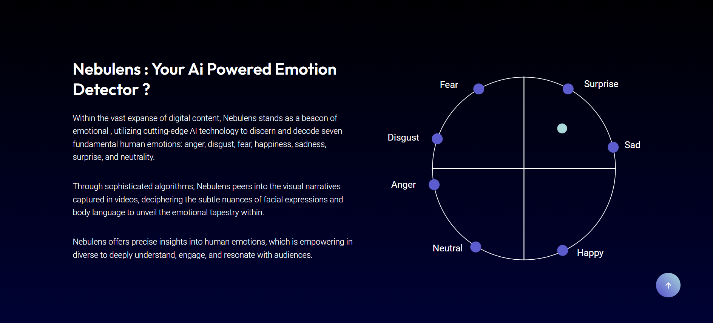
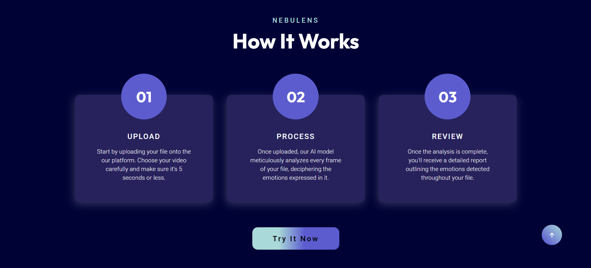

<h1>🌌 Nebulens — AI Video & Audio Emotion Detector</h1>

Nebulens is an AI-powered web platform that detects human emotions from video and audio inputs using deep learning models.
Built with React for the frontend, Flask for the backend, and TensorFlow for emotion recognition.

📌 Table of Contents

🚀 Features

🛠️ Tech Stack

📂 Project Structure

📸 Screenshots

⚡ Installation & Setup

🔗 API Endpoints

🧠 How It Works

📱 Responsiveness

📌 Future Improvements

📜 License

🚀 Features

✅ Upload video or audio files for analysis
✅ Predict emotions using deep learning models
✅ Real-time Flask API processing
✅ Fully responsive design (mobile, tablet, desktop)
✅ Clean, modern, and intuitive UI
✅ Accurate predictions with trained models

🛠️ Tech Stack
Frontend 🖥️

React.js — UI development

Axios — API communication

React Router — Navigation

CSS3 — Styling & responsiveness

Backend ⚡

Flask — REST API

Flask-CORS — Handling cross-origin requests

TensorFlow / Keras — Emotion detection models

Librosa — Audio feature extraction

OpenCV — Video frame processing

Praat + Parselmouth — Speech analysis

Machine Learning Models 🧠

Video Model → models/video_model.h5

Audio Model → models/audio_model.h5

📂 Project Structure
nebulens-ai-video-audio-emotion-detector/
│── frontend/               # React frontend
│   ├── src/
│   │   ├── assets/
│   │   │   ├── fonts/
│   │   │   ├── img/
│   │   ├── Components/
│   │   │   ├── Process
│   │   │   │   ├── Process.css
│   │   │   │   ├── Process.jsx  # Core component for predictions
│   │   │   ├── Navbar
│   │   │   │   ├── Navbar.css
│   │   │   │   ├── Navbar.jsx
│   │   │   ├── Home
│   │   │   │   ├── Home.css
│   │   │   │   ├── Home.jsx
│   │   │   ├── Steps
│   │   │   │   ├── Steps.css
│   │   │   │   ├── Steps.jsx
│   │   │   ├── Footer
│   │   │   │   ├── Footer.css
│   │   │   │   ├── Footer.jsx
│   │   ├── styles/
│   │   │   ├── App.css
│   │   │   ├── responsiveness.css
│   │   │   ├── reusable.css
│   │   ├── App.js
│   │   ├── index.js
│   └── public/
│
│── server/                 # Flask backend
│   ├── app.py              # Main API
│   ├── video_processing.py # Video feature extraction
│   ├── audio_processing.py # Audio feature extraction
│
│── models/                 # Trained ML models
│   ├── video_model.h5
│   ├── audio_model.h5
│
│── uploads/                # Temporary uploaded files
│── README.md

📸 Screenshots

	
Mobile View

⚡ Installation & Setup
1️⃣ Clone the Repository
git clone https://github.com/fahdElattar/fahdElattar-Nebulens-Ai-Video-Audio-Emotion-Detector.git
cd nebulens-ai-video-audio-emotion-detector

2️⃣ Setup Frontend (React)
cd frontend
npm install
npm start

The React app will run on http://localhost:3000

3️⃣ Setup Backend (Flask)
cd server
pip install -r requirements.txt
python app.py

The Flask API will run on http://localhost:5000

4️⃣ Install Required Python Packages
pip install flask flask-cors tensorflow opencv-python librosa praat-parselmouth numpy

🔗 API Endpoints
Method	Endpoint	Description	Input
POST	/predictVideo	Predict emotion from video	video/*
POST	/predictAudio	Predict emotion from audio	audio/*

Example Response:

{
  "emotion": "happy"
}

🧠 How It Works

Upload Video / Audio → From the React frontend.

Send to Flask API → File is uploaded via Axios.

Processing:

Video → OpenCV extracts frames → TensorFlow predicts emotion.

Audio → Librosa + Praat extract features → TensorFlow predicts emotion.

Return Prediction → Flask sends back detected emotion.

Frontend Displays Results 🎯

📱 Responsiveness

Your app is fully responsive thanks to responsiveness.css:

✅ Mobile-friendly

✅ Tablet-optimized

✅ Smooth layout scaling

📌 Future Improvements

🚀 Planned features:

 Deploy Flask API on Render / Railway

 Deploy frontend on Vercel

 Support for real-time emotion detection

 Improved UI/UX with animations

 Multi-language support

📜 License

This project is licensed under the Fahd El Attar License.